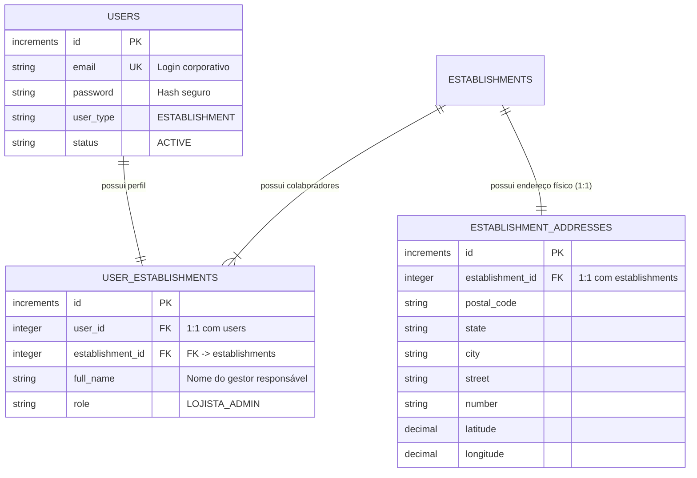
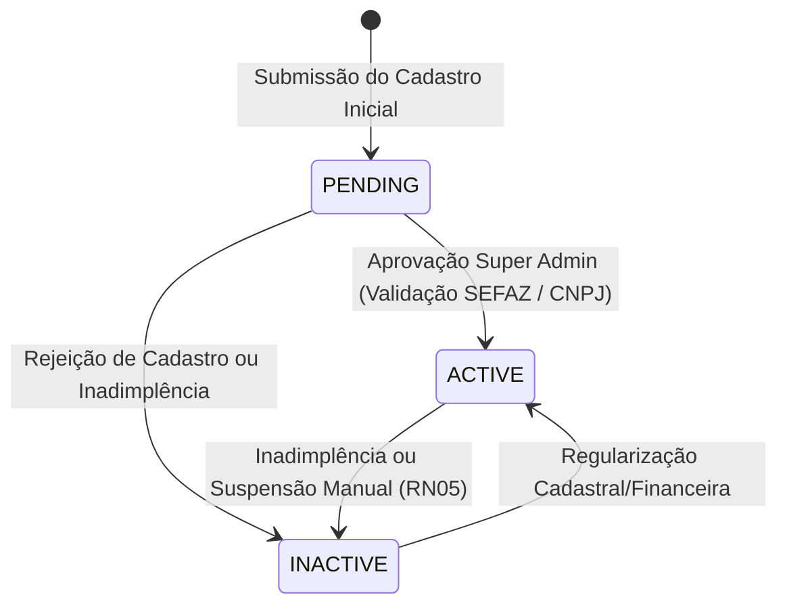

# Estrutura de Dados do Comércio (Lojista / Estabelecimento)

Este documento descreve detalhadamente a estrutura de dados, validações, ciclo de vida e contratos de entrada/saída para a funcionalidade de **Cadastro e Criação de Conta do Comércio (Lojista)** no sistema Cash-Me, alinhando com a vitrine de **Local Discovery**, regras de negócio (RN03, RN05, RN06) e o modelo relacional de banco de dados.

---

## 1. Visão Geral da Entidade e Contexto de Negócio

No ecossistema Cash-Me, o **Comércio** cumpre dois papéis fundamentais:

1. **Tenant Operacional de Fidelidade:** Entidade emissora e validadora de pontos através do cruzamento de notas fiscais (NFC-e) via CNPJ (`cnpj`).
2. **Vitrine & Local Discovery:** Perfil público exibido aos consumidores no aplicativo para descoberta de lojas físicas parceiras, contatos e localização por proximidade.

Para garantir alta coesão e manutenibilidade na arquitetura, os dados do comércio são divididos em:

- **`establishments`:** Dados fiscais, jurídicos, operacionais, regras de fidelidade padrão e canais de contato/redes sociais.
- **`establishment_addresses`:** Entidade separada com os dados de endereço físico, localização e georreferenciamento (latitude/longitude).
- **`users` & `user_establishments`:** Credenciais de autenticação e perfil do gestor responsável (`LOJISTA_ADMIN`).

O cadastro inicial do comércio é uma operação **atômica** (executada dentro de uma transação de banco de dados).

---

## 2. Dicionário de Dados do Estabelecimento (`establishments`)

### 2.1 Identificação Fiscal e Operacional

| Campo               | Tipo            | Obrigatório | Validações & Regras                                                                               | Descrição                                           |
| :------------------ | :-------------- | :---------- | :------------------------------------------------------------------------------------------------ | :-------------------------------------------------- |
| `id`                | `increments`    | Sim (PK)    | Auto-incremental gerado pelo banco.                                                               | Identificador único do estabelecimento.             |
| `cnpj`              | `VARCHAR(14)`   | **Sim**     | 14 dígitos numéricos, sem pontuação, algoritmo de dígitos verificadores válido, único no sistema. | CNPJ da matriz/filial para match da NFC-e (RN03).   |
| `legal_name`        | `VARCHAR(255)`  | **Sim**     | Mínimo 3 caracteres.                                                                              | Razão Social registrada na Receita Federal / SEFAZ. |
| `trade_name`        | `VARCHAR(255)`  | **Sim**     | Mínimo 2 caracteres.                                                                              | Nome Fantasia exibido na vitrine do app.            |
| `status`            | `VARCHAR(20)`   | **Sim**     | Default `'PENDING'`. Enum: `PENDING`, `ACTIVE`, `INACTIVE`.                                       | Status operacional do tenant (RN05 e RN06).         |
| `conversion_factor` | `DECIMAL(10,4)` | **Sim**     | Default `1.0000`. Valor numérico positivo $> 0$.                                                  | Fator padrão: R$ 1,00 gasto = X pontos (RN04).      |

### 2.2 Contato e Redes Sociais

| Campo          | Tipo           | Obrigatório no Cadastro | Validações & Regras                                   | Descrição                                        |
| :------------- | :------------- | :---------------------- | :---------------------------------------------------- | :----------------------------------------------- |
| `phone`        | `VARCHAR(20)`  | Não (Opcional)          | 10 a 11 dígitos com DDD (somente números).            | Telefone fixo comercial da loja física.          |
| `whatsapp`     | `VARCHAR(20)`  | Não (Opcional)          | 11 dígitos com DDD (somente números).                 | WhatsApp comercial para atendimento direto.      |
| `email`        | `VARCHAR(254)` | Não (Opcional)          | Formato válido de e-mail.                             | E-mail de contato público institucional da loja. |
| `website`      | `VARCHAR(255)` | Não (Opcional)          | URL válida (`http://` ou `https://`).                 | Website oficial do comércio.                     |
| `instagram`    | `VARCHAR(100)` | Não (Opcional)          | Handle com ou sem `@`, ou URL completa.               | Perfil no Instagram (vitrine social).            |
| `social_links` | `JSONB`        | Não (Opcional)          | Objeto JSON `{ "facebook": "...", "tiktok": "..." }`. | Links adicionais de canais e redes sociais.      |

### 2.3 Metadados de Auditoria

| Campo        | Tipo          | Descrição                                          |
| :----------- | :------------ | :------------------------------------------------- |
| `created_at` | `TIMESTAMPTZ` | Timestamp exato da submissão do cadastro.          |
| `updated_at` | `TIMESTAMPTZ` | Timestamp da última alteração de dados cadastrais. |

---

## 3. Dicionário de Dados do Endereço (`establishment_addresses`)

Entidade separada vinculada de forma 1:1 com `establishments`, isolando os dados de localização física e permitindo busca geoespacial por proximidade na vitrine.

> **Estratégia de UX:** O preenchimento do endereço pode ser acelerado pelo CEP (via ViaCEP / BrasilAPI) com consulta automática e preenchimento de logradouro, bairro, cidade e UF. A latitude e longitude podem ser derivadas via serviço de Geocoding.

| Campo              | Tipo               | Obrigatório     | Validações & Regras                                                               | Descrição                                              |
| :----------------- | :----------------- | :-------------- | :-------------------------------------------------------------------------------- | :----------------------------------------------------- |
| `id`               | `increments`       | Sim (PK)        | Auto-incremental gerado pelo banco.                                               | Identificador único do registro de endereço.           |
| `establishment_id` | `INTEGER UNSIGNED` | **Sim (FK/UK)** | Chave estrangeira única apontando para `establishments.id` (`ON DELETE CASCADE`). | Vínculo 1:1 com o estabelecimento parceiro.            |
| `postal_code`      | `VARCHAR(8)`       | **Sim**         | 8 dígitos numéricos (sem hífen).                                                  | CEP do estabelecimento comercial.                      |
| `state`            | `VARCHAR(2)`       | **Sim**         | Sigla UF em maiúsculas (ex: `'SC'`, `'PR'`).                                      | Unidade Federativa.                                    |
| `city`             | `VARCHAR(100)`     | **Sim**         | Máximo 100 caracteres.                                                            | Município onde o comércio está situado.                |
| `neighborhood`     | `VARCHAR(100)`     | **Sim**         | Máximo 100 caracteres.                                                            | Bairro.                                                |
| `street`           | `VARCHAR(255)`     | **Sim**         | Máximo 255 caracteres.                                                            | Rua, Avenida, Travessa, etc.                           |
| `number`           | `VARCHAR(20)`      | **Sim**         | Alfanumérico (ex: `'120'`, `'S/N'`).                                              | Número predial.                                        |
| `complement`       | `VARCHAR(100)`     | Não (Opcional)  | Texto livre até 100 caracteres.                                                   | Sala, Loja, Pavimento, Bloco.                          |
| `reference`        | `VARCHAR(255)`     | Não (Opcional)  | Texto livre até 255 caracteres.                                                   | Ponto de referência para o cliente físico.             |
| `latitude`         | `DECIMAL(10,8)`    | Não (Opcional)  | Faixa de -90.00000000 a +90.00000000.                                             | Coordenada geográfica para mapa e raio de proximidade. |
| `longitude`        | `DECIMAL(11,8)`    | Não (Opcional)  | Faixa de -180.00000000 a +180.00000000.                                           | Coordenada geográfica para mapa e raio de proximidade. |
| `created_at`       | `TIMESTAMPTZ`      | Sim             | Timestamp de criação.                                                             | Data de registro do endereço.                          |
| `updated_at`       | `TIMESTAMPTZ`      | Não (Nullable)  | Timestamp de atualização.                                                         | Data de alteração do endereço.                         |

---

## 4. Dados do Usuário Gestor (`users` e `user_establishments`)

Para que o lojista acesse o painel administrativo, o cadastro atômico cria simultaneamente as credenciais e o perfil do gestor:



---

## 5. Ciclo de Vida do Comércio (State Machine)



- **`PENDING` (RN06):** Conta criada. O lojista pode autenticar-se e configurar sua loja, mas notas fiscais emitidas por esse CNPJ ainda não pontuam para clientes até que ocorra validação humana/SEFAZ.
- **`ACTIVE`:** Conta aprovada e operando no app. Pontua clientes normalmente (RN03) e aparece na vitrine de descoberta.
- **`INACTIVE` (RN05):** Bloqueio de novas pontuações de NFC-e. Clientes preservam o saldo histórico já acumulado.

---

## 6. Contrato de Entrada (API Request Payload)

### Endpoint Proposto: `POST /api/v1/auth/establishment/signup`

```json
{
  "user": {
    "fullName": "Mariana Souza",
    "email": "mariana@padariapaoquentinho.com.br",
    "password": "SenhaSegura@123",
    "passwordConfirmation": "SenhaSegura@123"
  },
  "establishment": {
    "cnpj": "12345678000195",
    "legalName": "Padaria Pão Quentinho Ltda",
    "tradeName": "Padaria Pão Quentinho",
    "conversionFactor": 1.0,
    "contact": {
      "phone": "4832220000",
      "whatsapp": "48999990000",
      "email": "contato@padariapaoquentinho.com.br",
      "website": "https://paoquentinho.com.br",
      "instagram": "@paoquentinhofloripa",
      "socialLinks": {
        "facebook": "https://facebook.com/paoquentinho"
      }
    }
  },
  "address": {
    "postalCode": "88010000",
    "state": "SC",
    "city": "Florianópolis",
    "neighborhood": "Centro",
    "street": "Rua Felipe Schmidt",
    "number": "515",
    "complement": "Loja 02",
    "reference": "Em frente à praça central",
    "latitude": -27.5969,
    "longitude": -48.5495
  }
}
```

### Resposta de Sucesso: `201 Created`

```json
{
  "message": "Comércio cadastrado com sucesso. Sua conta está pendente de homologação.",
  "user": {
    "id": 10,
    "email": "mariana@padariapaoquentinho.com.br",
    "userType": "ESTABLISHMENT",
    "status": "ACTIVE"
  },
  "profile": {
    "id": 8,
    "fullName": "Mariana Souza",
    "role": "LOJISTA_ADMIN"
  },
  "establishment": {
    "id": 5,
    "cnpj": "12345678000195",
    "legalName": "Padaria Pão Quentinho Ltda",
    "tradeName": "Padaria Pão Quentinho",
    "status": "PENDING",
    "conversionFactor": 1.0,
    "contact": {
      "phone": "4832220000",
      "whatsapp": "48999990000",
      "email": "contato@padariapaoquentinho.com.br",
      "website": "https://paoquentinho.com.br",
      "instagram": "@paoquentinhofloripa",
      "socialLinks": {
        "facebook": "https://facebook.com/paoquentinho"
      }
    }
  },
  "address": {
    "id": 5,
    "establishmentId": 5,
    "postalCode": "88010000",
    "state": "SC",
    "city": "Florianópolis",
    "neighborhood": "Centro",
    "street": "Rua Felipe Schmidt",
    "number": "515",
    "complement": "Loja 02",
    "reference": "Em frente à praça central",
    "latitude": -27.5969,
    "longitude": -48.5495
  },
  "token": "oat_..."
}
```
